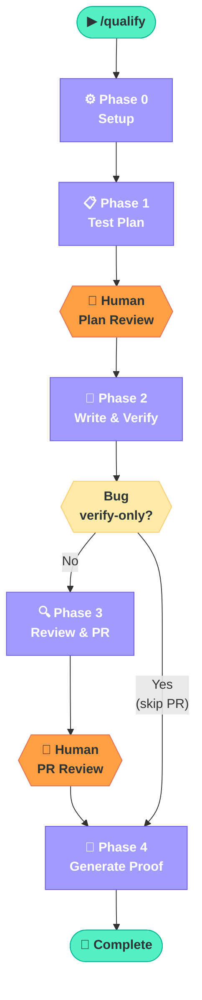
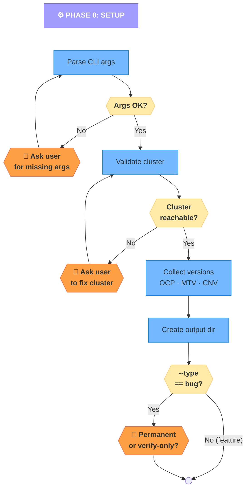
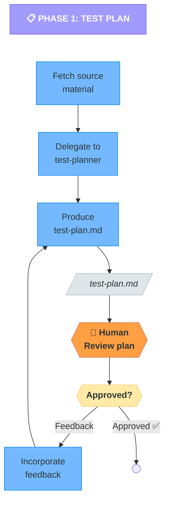
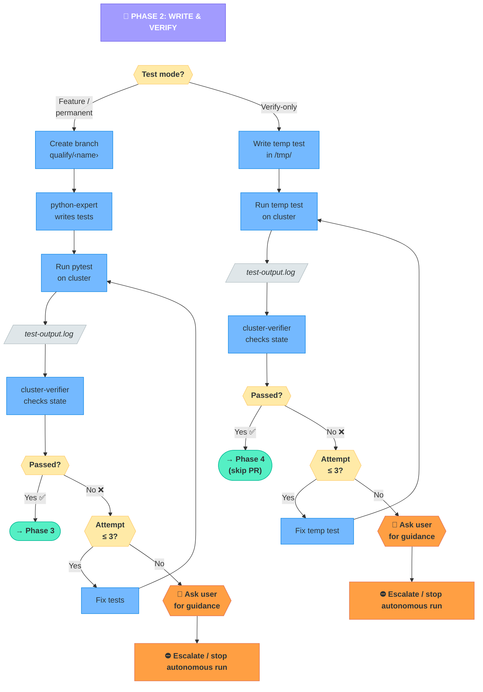
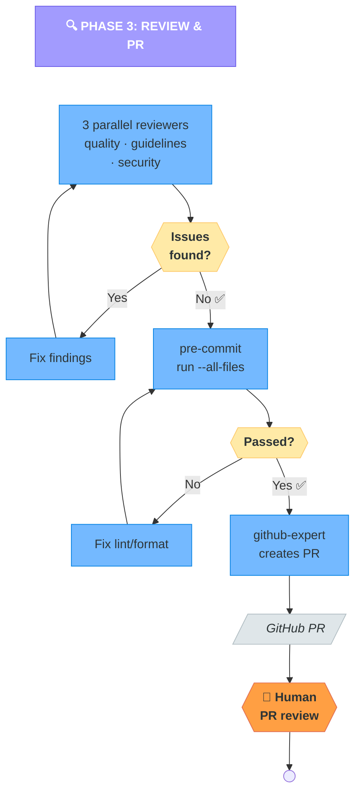
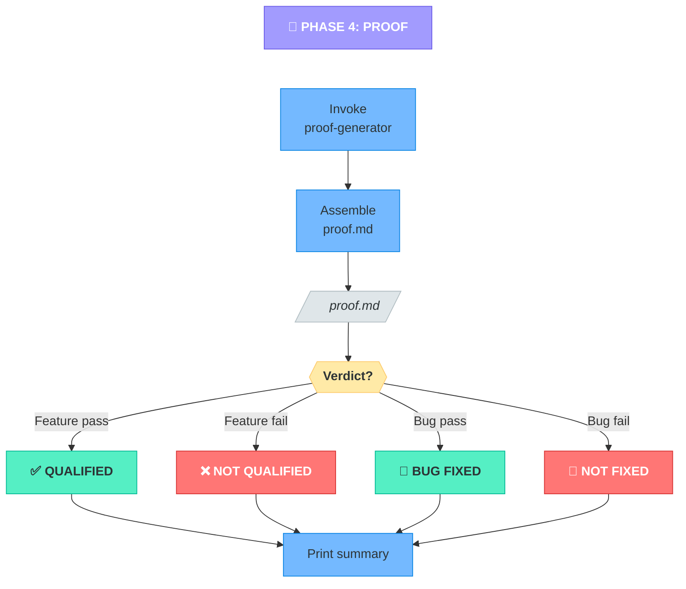
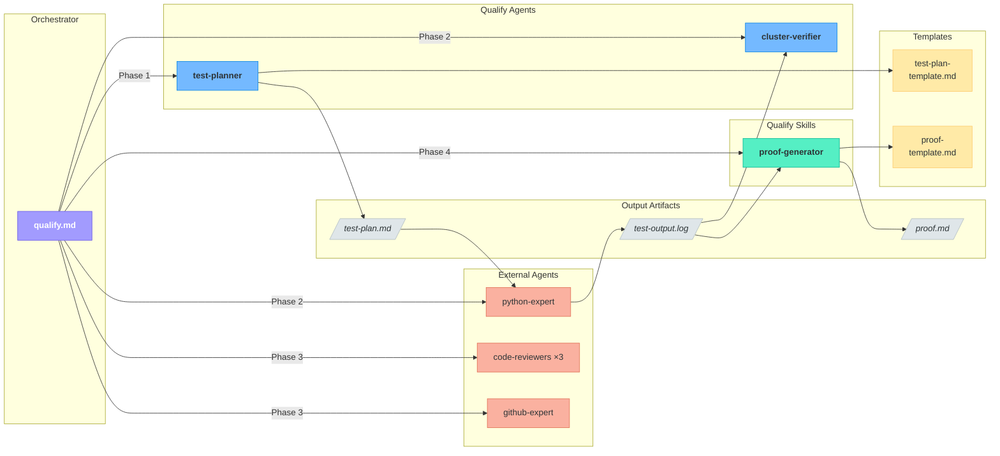
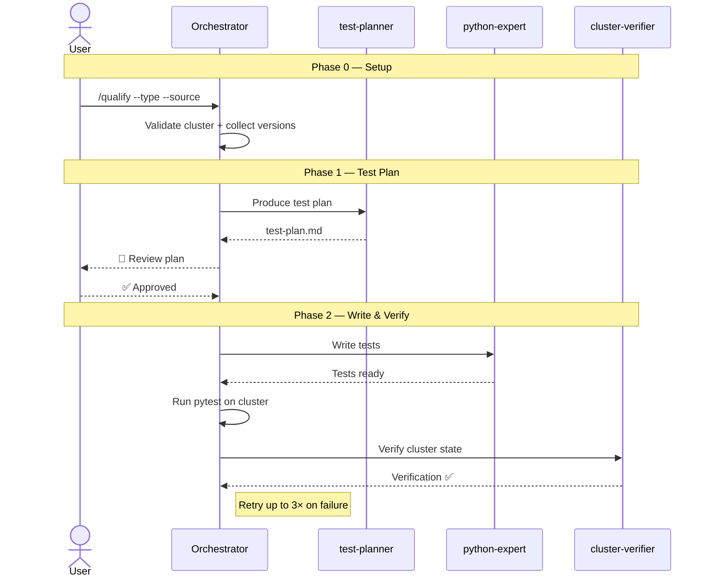
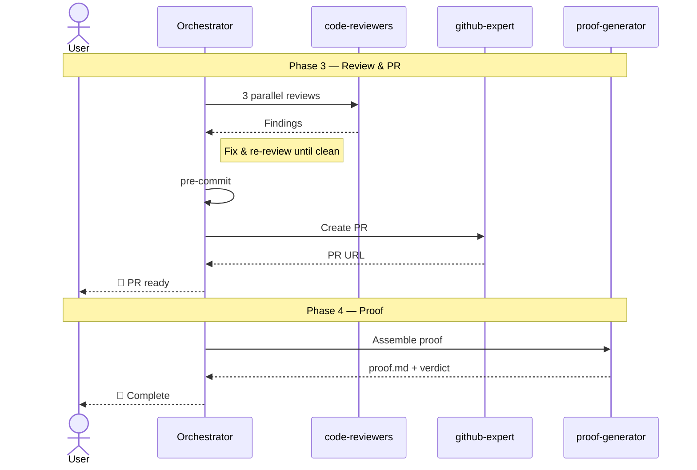

# `/qualify` — AI Qualification Workflow Diagrams

The `/qualify` workflow automates end-to-end qualification of MTV features and bug fixes:
from reading a design doc or bug report, through writing and executing tests on a real OpenShift cluster,
to producing a verified proof report and PR.
This document visualizes the workflow's phases, component relationships, and inter-agent communication.

---

## 1. High-Level Overview

Five phases from setup to proof, showing the bug verify-only shortcut and human checkpoints.

---

## 2. Phase 0 — Setup

Parse arguments, validate cluster, collect versions, determine bug mode.

---

## 3. Phase 1 — Test Plan

Fetch source, delegate to test-planner, human review loop.

---

## 4. Phase 2 — Write & Verify Tests

Two paths: feature/permanent-test (creates branch) vs. bug verify-only (temp test). Both run on a real cluster with cluster-verifier validation.

---

## 5. Phase 3 — Code Review & PR

Three parallel reviewers, fix loop, pre-commit, then PR creation.

---

## 6. Phase 4 — Generate Proof

Assemble proof report, determine verdict, print summary.

---

## 7. Component Relationship Diagram

How the orchestrator, agents, skills, templates, and artifacts relate to each other.

---

## 8. Sequence Diagrams

Happy-path interaction split into two diagrams for readability.

### 8a. Setup, Plan & Write (Phases 0–2)

### 8b. Review, PR & Proof (Phases 3–4)

---

## Legend

| Shape | Meaning |
| ------- | --------- |
| 🟪 Purple rounded | Phase header |
| 🟦 Blue rectangle | Agent / automated action |
| 🟧 Orange hexagon | 🛑 Human checkpoint — requires user input |
| 🟨 Yellow diamond | Decision point |
| ⬜ Gray parallelogram | Output artifact (file) |
| 🟩 Green rounded | Start / success outcome |
| 🟥 Red rounded | Failure outcome |
| 🔴 Coral | External agent (not in qualify/) |

## Key Takeaways

1. **Five distinct phases** with clear handoff boundaries.
2. **Human stays in the loop** at test-plan review, bug-mode decision, stuck escalation, and PR review — everything else is autonomous.
3. **Dual verification** — pytest execution alone is never sufficient; the `cluster-verifier` agent independently confirms cluster state.
4. **Bug workflows fork early** (Phase 0) into permanent-test vs. verify-only, rejoining at proof generation (Phase 4).
5. **Three parallel code reviewers** in Phase 3 ensure quality, guideline compliance, and security before any PR is created.
6. **Self-contained proof** — `proof.md` captures test results, cluster evidence, version info, and raw YAML so the qualification can be audited without re-running anything.
