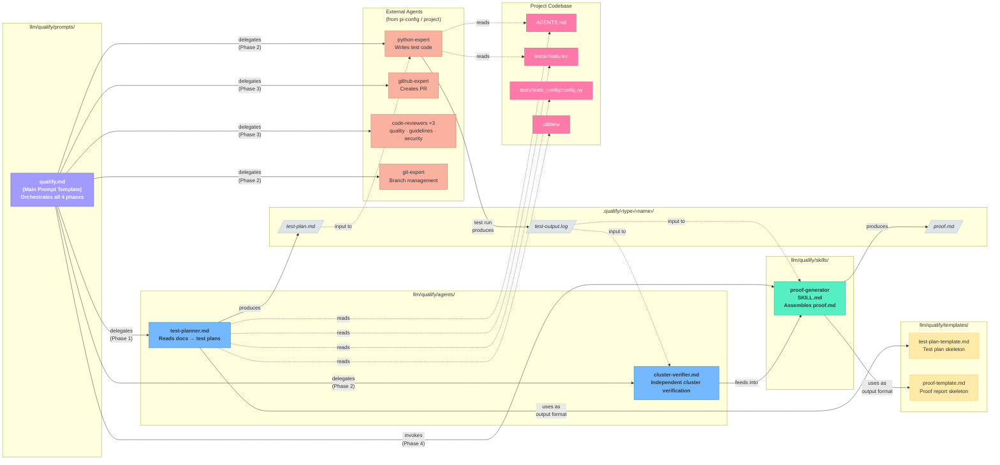

# `/qualify` — AI Qualification Workflow Diagrams

The `/qualify` workflow automates end-to-end qualification of MTV features and bug fixes:
from reading a design doc or bug report, through writing and executing tests on a real OpenShift cluster,
to producing a verified proof report and PR.
This document visualizes the workflow's phases, component relationships, and inter-agent communication.

---

## 1. Main Workflow Flowchart

Four phases from setup to proof, showing the feature vs. bug split, human checkpoints, agent delegations, decision points, and generated artifacts.

```mermaid
flowchart TD
    classDef human fill:#ff9f43,stroke:#e17055,color:#2d3436,font-weight:bold
    classDef agent fill:#74b9ff,stroke:#0984e3,color:#2d3436
    classDef decision fill:#ffeaa7,stroke:#fdcb6e,color:#2d3436,font-weight:bold
    classDef artifact fill:#dfe6e9,stroke:#b2bec3,color:#2d3436,font-style:italic
    classDef phase fill:#a29bfe,stroke:#6c5ce7,color:#fff,font-weight:bold
    classDef fail fill:#ff7675,stroke:#d63031,color:#fff,font-weight:bold
    classDef success fill:#55efc4,stroke:#00b894,color:#2d3436,font-weight:bold

    START(["/qualify --type --source --cluster --name"]):::success

    subgraph P0["Phase 0 — Parse Arguments & Setup"]
        direction TB
        P0_TITLE["⚙️ PHASE 0: SETUP"]:::phase
        PARSE["Parse CLI arguments\n--type, --source, --cluster, --name"]:::agent
        VALIDATE_ARGS{{"Required args\npresent?"}}:::decision
        ASK_ARGS{{{"🛑 Ask user\nfor missing args"}}}:::human
        CLUSTER_CHECK["Validate cluster connectivity\noc whoami · oc cluster-info"]:::agent
        CLUSTER_OK{{"Cluster\nreachable?"}}:::decision
        CLUSTER_FAIL{{{"🛑 Ask user\nto fix cluster"}}}:::human
        VERSIONS["Collect environment versions\nOCP · MTV · CNV"]:::agent
        MKDIR["Create output directory\n.qualify/‹type›/‹name›/"]:::agent
        IS_BUG{{"--type\n== bug?"}}:::decision
        BUG_ASK{{{"🛑 Permanent test\nor verify-only?"}}}:::human
        SET_PERM["Set mode:\npermanent-test"]:::agent
        SET_VERIFY["Set mode:\nverify-only"]:::agent

        P0_TITLE ~~~ PARSE
        PARSE --> VALIDATE_ARGS
        VALIDATE_ARGS -- "No" --> ASK_ARGS --> PARSE
        VALIDATE_ARGS -- "Yes" --> CLUSTER_CHECK
        CLUSTER_CHECK --> CLUSTER_OK
        CLUSTER_OK -- "No" --> CLUSTER_FAIL --> CLUSTER_CHECK
        CLUSTER_OK -- "Yes" --> VERSIONS --> MKDIR --> IS_BUG
        IS_BUG -- "Yes" --> BUG_ASK
        IS_BUG -- "No (feature)" --> P0_END
        BUG_ASK -- "Permanent test" --> SET_PERM --> P0_END
        BUG_ASK -- "Verify-only" --> SET_VERIFY --> P0_END
    end

    P0_END((" "))

    subgraph P1["Phase 1 — Test Plan"]
        direction TB
        P1_TITLE["📋 PHASE 1: TEST PLAN"]:::phase
        FETCH["Fetch source material\nfetch_content (URL) · read (file)"]:::agent
        DELEGATE_TP["Delegate to\ntest-planner agent"]:::agent
        TP_READ["test-planner reads:\nAGENTS.md · tests/ · config.py\nutilities/ · templates"]:::agent
        TP_PRODUCE["Produce structured\ntest-plan.md"]:::agent
        TP_ARTIFACT[/"💾 .qualify/‹type›/‹name›/test-plan.md"/]:::artifact
        HUMAN_REVIEW{{{"🛑 HUMAN CHECKPOINT\nReview test plan"}}}:::human
        PLAN_OK{{"Plan\napproved?"}}:::decision
        PLAN_FEEDBACK["Incorporate feedback\nupdate test-plan.md"]:::agent

        P1_TITLE ~~~ FETCH
        FETCH --> DELEGATE_TP --> TP_READ --> TP_PRODUCE --> TP_ARTIFACT --> HUMAN_REVIEW
        HUMAN_REVIEW --> PLAN_OK
        PLAN_OK -- "Feedback" --> PLAN_FEEDBACK --> TP_PRODUCE
        PLAN_OK -- "Approved ✅" --> P1_END
    end

    P1_END((" "))

    subgraph P2["Phase 2 — Write & Verify Tests"]
        direction TB
        P2_TITLE["🧪 PHASE 2: WRITE & VERIFY (Autonomous)"]:::phase
        MODE_CHECK{{"Test\nmode?"}}:::decision

        subgraph PERM["Feature / Bug-Permanent-Test Path"]
            direction TB
            GIT_BRANCH["Create branch\nqualify/‹name›"]:::agent
            WRITE_TESTS["Delegate to python-expert\nWrite tests (5/6-step pattern)\nConfig + fixtures + test file"]:::agent
            RUN_TESTS["Run tests on real cluster\nuv run pytest … 2>&1 | tee test-output.log"]:::agent
            TEST_LOG[/"💾 .qualify/‹type›/‹name›/test-output.log"/]:::artifact
            DELEGATE_CV["Delegate to\ncluster-verifier agent"]:::agent
            CV_CHECK["cluster-verifier independently\nchecks cluster state\nVM · PVC · Plan · Migration · Network"]:::agent
            EVAL{{"Tests passed\nAND verification\npassed?"}}:::decision
            ATTEMPT_COUNT{{"Attempt\n≤ 3?"}}:::decision
            FIX_TESTS["python-expert\nfixes tests"]:::agent
            STUCK_ASK{{{"🛑 AI stuck\nAsk user for guidance"}}}:::human
        end

        subgraph VONLY["Bug Verify-Only Path"]
            direction TB
            WRITE_TEMP["Write temp test\nin /tmp/qualify-‹name›/"]:::agent
            RUN_TEMP["Run temp test on cluster\nuv run pytest …"]:::agent
            TEMP_LOG[/"💾 .qualify/bugs/‹name›/test-output.log"/]:::artifact
            CV_TEMP["Delegate to\ncluster-verifier agent"]:::agent
            EVAL_TEMP{{"Passed?"}}:::decision
            ATTEMPT_TEMP{{"Attempt\n≤ 3?"}}:::decision
            FIX_TEMP["Fix temp test"]:::agent
            STUCK_TEMP{{{"🛑 AI stuck\nAsk user"}}}:::human
        end

        P2_TITLE ~~~ MODE_CHECK
        MODE_CHECK -- "feature / permanent" --> GIT_BRANCH
        MODE_CHECK -- "verify-only" --> WRITE_TEMP

        GIT_BRANCH --> WRITE_TESTS --> RUN_TESTS --> TEST_LOG --> DELEGATE_CV --> CV_CHECK --> EVAL
        EVAL -- "Yes ✅" --> P2_PASS_PERM
        EVAL -- "No ❌" --> ATTEMPT_COUNT
        ATTEMPT_COUNT -- "Yes" --> FIX_TESTS --> RUN_TESTS
        ATTEMPT_COUNT -- "No (3 failures)" --> STUCK_ASK --> FIX_TESTS

        WRITE_TEMP --> RUN_TEMP --> TEMP_LOG --> CV_TEMP --> EVAL_TEMP
        EVAL_TEMP -- "Yes ✅" --> P2_PASS_VONLY
        EVAL_TEMP -- "No ❌" --> ATTEMPT_TEMP
        ATTEMPT_TEMP -- "Yes" --> FIX_TEMP --> RUN_TEMP
        ATTEMPT_TEMP -- "No (3 failures)" --> STUCK_TEMP --> FIX_TEMP
    end

    P2_PASS_PERM((" "))
    P2_PASS_VONLY((" "))

    subgraph P3["Phase 3 — Code Review & PR"]
        direction TB
        P3_TITLE["🔍 PHASE 3: CODE REVIEW & PR"]:::phase
        REVIEW_PARALLEL["Run 3 parallel code reviewers\n quality · guidelines · security"]:::agent
        REVIEW_ISSUES{{"Issues\nfound?"}}:::decision
        FIX_ISSUES["Fix review findings"]:::agent
        PRECOMMIT["Run pre-commit\npre-commit run --all-files"]:::agent
        PRECOMMIT_OK{{"Pre-commit\npassed?"}}:::decision
        FIX_PRECOMMIT["Fix formatting/linting"]:::agent
        CREATE_PR["Delegate to github-expert\nCreate PR: [qualify] ‹type›: ‹name›"]:::agent
        PR_ARTIFACT[/"💾 GitHub PR with proof link"/]:::artifact
        PR_REVIEW{{{"🛑 HUMAN CHECKPOINT\nPR review"}}}:::human

        P3_TITLE ~~~ REVIEW_PARALLEL
        REVIEW_PARALLEL --> REVIEW_ISSUES
        REVIEW_ISSUES -- "Yes" --> FIX_ISSUES --> REVIEW_PARALLEL
        REVIEW_ISSUES -- "No ✅" --> PRECOMMIT
        PRECOMMIT --> PRECOMMIT_OK
        PRECOMMIT_OK -- "No" --> FIX_PRECOMMIT --> PRECOMMIT
        PRECOMMIT_OK -- "Yes ✅" --> CREATE_PR --> PR_ARTIFACT --> PR_REVIEW
    end

    subgraph P4["Phase 4 — Generate Proof"]
        direction TB
        P4_TITLE["📜 PHASE 4: GENERATE PROOF"]:::phase
        INVOKE_SKILL["Invoke proof-generator skill\nRead SKILL.md + proof-template.md"]:::agent
        ASSEMBLE["Assemble proof.md\nTest results · Cluster evidence\nVersions · Raw YAML"]:::agent
        PROOF_ARTIFACT[/"💾 .qualify/‹type›/‹name›/proof.md"/]:::artifact
        VERDICT{{"Determine\nverdict"}}:::decision
        V_QUAL["✅ QUALIFIED"]:::success
        V_NOTQUAL["❌ NOT QUALIFIED"]:::fail
        V_FIXED["🐛 BUG FIXED"]:::success
        V_NOTFIXED["🐛 BUG NOT FIXED"]:::fail
        SUMMARY["Print final summary\nType · Name · Result · Artifacts · Versions"]:::agent

        P4_TITLE ~~~ INVOKE_SKILL
        INVOKE_SKILL --> ASSEMBLE --> PROOF_ARTIFACT --> VERDICT
        VERDICT -- "Feature pass" --> V_QUAL --> SUMMARY
        VERDICT -- "Feature fail" --> V_NOTQUAL --> SUMMARY
        VERDICT -- "Bug pass" --> V_FIXED --> SUMMARY
        VERDICT -- "Bug fail" --> V_NOTFIXED --> SUMMARY
    end

    DONE(["🏁 Qualification Complete"]):::success

    START --> P0
    P0_END --> P1
    P1_END --> P2
    P2_PASS_PERM --> P3
    P2_PASS_VONLY --> P4
    PR_REVIEW --> P4
    SUMMARY --> DONE
```

---

## 2. Component Relationship Diagram

How the prompt template, agents, skill, templates, and output artifacts relate to each other.



---

## 3. Sequence Diagram

Interaction timeline between the User, Orchestrator (`qualify.md`), and all agents/skills across the four phases.

```mermaid
sequenceDiagram
    box rgb(255, 245, 235) Human
        actor User
    end
    box rgb(230, 240, 255) Orchestrator
        participant Orch as qualify.md<br/>(Orchestrator)
    end
    box rgb(220, 245, 255) Agents
        participant TP as test-planner
        participant PE as python-expert
        participant CV as cluster-verifier
        participant CR as code-reviewers<br/>(×3 parallel)
        participant GE as github-expert
    end
    box rgb(220, 255, 235) Skills
        participant PG as proof-generator
    end
    box rgb(255, 230, 230) Cluster
        participant K8s as OpenShift<br/>Cluster
    end

    Note over User,K8s: Phase 0 — Parse Arguments & Setup

    User ->>+ Orch: /qualify --type feature --source <url> --cluster <path>
    Orch ->> Orch: Parse CLI arguments
    alt Missing required args
        Orch -->> User: Ask for missing arguments
        User -->> Orch: Provide arguments
    end
    Orch ->>+ K8s: oc whoami · oc cluster-info
    K8s -->>- Orch: Cluster identity & status
    alt Cluster unreachable
        Orch -->> User: 🛑 Cluster unreachable — please fix
        User -->> Orch: Cluster fixed
        Orch ->> K8s: Retry connectivity
    end
    Orch ->>+ K8s: Collect versions (OCP, MTV, CNV)
    K8s -->>- Orch: Version strings
    Orch ->> Orch: Create .qualify/‹type›/‹name›/
    opt type == bug
        Orch -->> User: 🛑 Permanent test or verify-only?
        User -->> Orch: Decision (permanent / verify-only)
    end

    Note over User,K8s: Phase 1 — Test Plan

    Orch ->> Orch: Fetch source material (URL or file)
    Orch ->>+ TP: Delegate: produce test plan
    TP ->> TP: Read AGENTS.md, tests/, config.py,<br/>utilities/, test-plan-template.md
    TP ->> TP: Analyze source material
    TP -->>- Orch: test-plan.md

    Orch ->> Orch: Save .qualify/‹type›/‹name›/test-plan.md
    Orch -->> User: 🛑 HUMAN CHECKPOINT: Review test plan

    loop Until approved
        User -->> Orch: Feedback or Approved
        alt Feedback provided
            Orch ->> TP: Update plan with feedback
            TP -->> Orch: Revised test-plan.md
            Orch -->> User: Updated plan — please re-review
        end
    end

    User -->> Orch: ✅ Plan approved

    Note over User,K8s: Phase 2 — Write & Verify Tests (Autonomous)

    alt Feature or Bug-Permanent-Test
        Orch ->> Orch: git checkout -b qualify/‹name›
        Orch ->>+ PE: Delegate: write tests per approved plan
        PE ->> PE: Read AGENTS.md, follow 5/6-step pattern
        PE ->> PE: Create config entry, fixtures, test file
        PE -->>- Orch: Test code ready

        loop Until pass or stuck (max 3 retries)
            Orch ->>+ K8s: uv run pytest … | tee test-output.log
            K8s -->>- Orch: Test results + output

            Orch ->>+ CV: Delegate: verify cluster state
            CV ->>+ K8s: oc get vm, pvc, plan, migration …
            K8s -->>- CV: Resource states + YAML
            CV ->> CV: Compare against test plan expectations
            CV -->>- Orch: Verification report (PASS/FAIL per check)

            alt Tests PASS + Verification PASS
                Note over Orch: ✅ Proceed to Phase 3
            else Tests FAIL or Verification FAIL
                alt Attempt ≤ 3
                    Orch ->>+ PE: Fix failing tests
                    PE -->>- Orch: Updated test code
                else Attempt > 3
                    Orch -->> User: 🛑 Stuck on: ‹problem›
                    User -->> Orch: Guidance
                    Orch ->> PE: Apply user guidance
                end
            end
        end

    else Bug Verify-Only
        Orch ->>+ PE: Write temp test in /tmp/qualify-‹name›/
        PE -->>- Orch: Temp test ready

        loop Until pass or stuck
            Orch ->>+ K8s: Run temp test on cluster
            K8s -->>- Orch: Test results
            Orch ->>+ CV: Verify cluster state
            CV ->>+ K8s: oc get …
            K8s -->>- CV: Resource states
            CV -->>- Orch: Verification report
            alt FAIL & retries remain
                Orch ->> PE: Fix temp test
            else FAIL & stuck
                Orch -->> User: 🛑 Stuck — need guidance
                User -->> Orch: Guidance
            end
        end
        Note over Orch: Skip Phase 3 → go to Phase 4
    end

    Note over User,K8s: Phase 3 — Code Review & PR (permanent tests only)

    alt Feature or Bug-Permanent-Test
        par Quality Review
            Orch ->>+ CR: code-reviewer-quality
            CR -->>- Orch: Quality findings
        and Guidelines Review
            Orch ->>+ CR: code-reviewer-guidelines
            CR -->>- Orch: Guidelines findings
        and Security Review
            Orch ->>+ CR: code-reviewer-security
            CR -->>- Orch: Security findings
        end

        loop Until no findings
            alt Issues found
                Orch ->> PE: Fix review issues
                PE -->> Orch: Fixes applied
                Orch ->> CR: Re-review
                CR -->> Orch: Updated findings
            end
        end

        Orch ->> Orch: pre-commit run --all-files
        loop Until pre-commit passes
            alt Failures
                Orch ->> Orch: Fix formatting/linting
            end
        end

        Orch ->>+ GE: Create PR: [qualify] ‹type›: ‹name›
        GE -->>- Orch: PR URL
        Orch -->> User: 🛑 PR ready for review
    end

    Note over User,K8s: Phase 4 — Generate Proof

    Orch ->>+ PG: Assemble proof report
    Note right of PG: Inputs:<br/>• test-output.log<br/>• cluster verification report<br/>• OCP/MTV/CNV versions<br/>• test-plan.md reference
    PG ->> PG: Apply proof-template.md structure
    PG ->> PG: Determine verdict:<br/>QUALIFIED / NOT QUALIFIED /<br/>BUG FIXED / BUG NOT FIXED
    PG -->>- Orch: proof.md

    Orch ->> Orch: Write .qualify/‹type›/‹name›/proof.md

    Orch -->>- User: 🏁 Qualification Complete<br/>Result + Artifacts + Versions
```



---

## Legend

| Shape | Meaning |
| ------- | --------- |
| 🟪 Purple rounded | Phase header |
| 🟦 Blue rectangle | Agent / automated action |
| 🟧 Orange hexagon | 🛑 Human checkpoint — requires user input |
| 🟨 Yellow diamond | Decision point |
| ⬜ Gray parallelogram | Output artifact (file) |
| 🟩 Green rounded | Start / success outcome |
| 🟥 Red rounded | Failure outcome |
| 🟤 Pink | Codebase reference |
| 🔴 Coral | External agent (not in qualify/) |

## Key Takeaways

1. **Four distinct phases** with clear handoff boundaries.
2. **Human stays in the loop** at test-plan review, bug-mode decision, stuck escalation, and PR review — everything else is autonomous.
3. **Dual verification** — pytest execution alone is never sufficient; the `cluster-verifier` agent independently confirms cluster state.
4. **Bug workflows fork early** (Phase 0) into permanent-test vs. verify-only, rejoining at proof generation (Phase 4).
5. **Three parallel code reviewers** in Phase 3 ensure quality, guideline compliance, and security before any PR is created.
6. **Self-contained proof** — `proof.md` captures test results, cluster evidence, version info, and raw YAML so the qualification can be audited without re-running anything.
